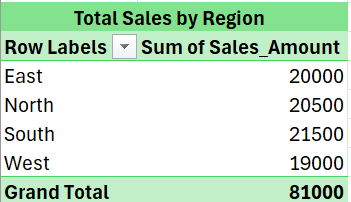

# 📊 Sales Performance Analysis using Excel

## 📌 Project Overview

This project analyzes sales data using Excel to derive business insights and evaluate performance across products, regions, and salespersons.

## 🛠 Tools & Skills Used

* Microsoft Excel
* VLOOKUP
* IF / IFS / Nested IF
* SUMIF / SUMIFS
* COUNTIF / COUNTIFS
* Pivot Tables
* Conditional Formatting

---

## 📊 Section 1: VLOOKUP

* Retrieved Product Name from Product Master table
* Fetched product prices using lookup functions

---

## 📊 Section 2: Logical Functions

* Created Performance Category:

  * High → Sales > 15000
  * Medium → 5000–15000
  * Low → < 5000
* Categorized regions using IFS:

  * North → Zone 1
  * South → Zone 2
  * East → Zone 3
  * West → Zone 4
* Assigned Bonus using Nested IF:

  * High → 10%
  * Medium → 5%
  * Low → 2%

---

## 📊 Section 3: Aggregations

* Calculated total sales for Electronics category (SUMIF)
* Calculated total sales for North region & Clothing category (SUMIFS)
* Calculated total quantity sold by specific salesperson

---

## 📊 Section 4: Counting Analysis

* Counted orders in Furniture category
* Counted orders where:

  * Region = South
  * Sales > 5000

---

## 📊 Section 5: Pivot Tables

* Total Sales by Region
* Total Sales by Category
* Salesperson vs Sales

---

## 📊 Section 6: Conditional Formatting

* Highlighted high and low sales
* Applied data bars for visualization
* Identified top 3 sales values

---

## 📷 Screenshots

---

## 🚀 Conclusion

This project demonstrates strong Excel skills in data analysis, reporting, and visualization for business decision-making.
